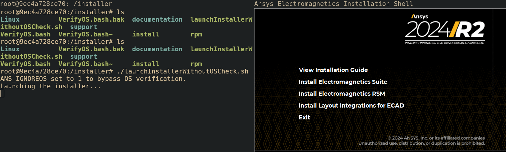

# Ansys_Docker_Container

The following is a docker file for ansys which contains the pre requires along with X window forwarding for a X-Org based desktop environment in Linux such as i3 or older versions of Gnome. Due to copyright restrictions and space constrains the installer will not be included with this repository but a folder where the installer can be kept will be included.


## Steps to use

1. Including the Installer File
Include your Ansys Installer in the Electronics_242_linx64 folder inside the repository. 


2. Building the Docker Container

Using the included script of start_ansys_docker.sh the docker build process will take place. Currently it is setup to automatically remove the docker container and rebuild. This allows for further modifications if needed but can be adjusted for deployment purposes.

The following variables can be adjusted to change the image name, container name, or installation directory.
``` sh
# Variables
IMAGE_NAME="ubuntu_ansys"
CONTAINER_NAME="ansys_container"
INSTALLER_DIR="./Electronics_242_linx64/"

```

2. Using the Container

Once built the containers directory should look as follows.

``` sh
root@9ec4a728ce70:/installer# ls
Linux          VerifyOS.bash.bak  documentation  launchInstallerWithoutOSCheck.sh  support
VerifyOS.bash  VerifyOS.bash~     install        rpm
```

Ansys by default has to use a certian version of Ubuntu to run, however given all of the dependices were previously installed a included script bypasses that OS verification. Launching the launchInstallerWithoutOSCheck script results in the following

|  | 
|:--:| 
| *Launching the Ansys Installer* |

The Electromagnetics Suite can then be installed as normal.

3. Launching Ansys
Ansys by default is installed in the following directory and can be launched from the following directory.

``` sh
root@9ec4a728ce70:/opt/AnsysEM/v242/Linux64# pwd
/opt/AnsysEM/v242/Linux64
root@9ec4a728ce70:/opt/AnsysEM/v242/Linux64# ./ansysedt
```
